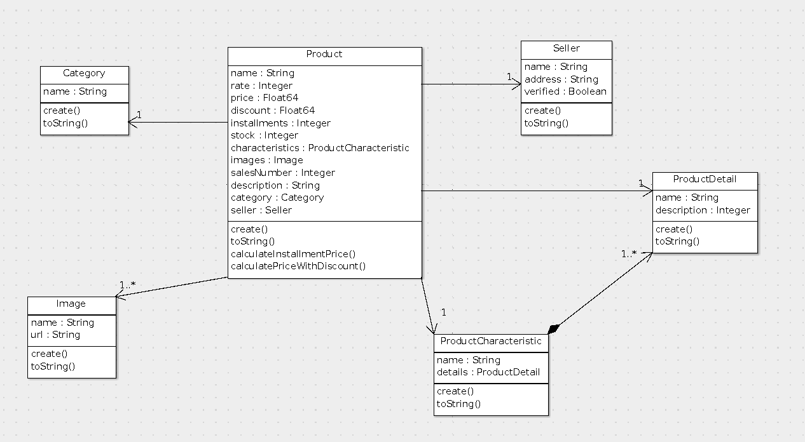

# 🛒 Products API

API REST desarrollada en **Go (Golang)** con **Echo Framework**, siguiendo una arquitectura en capas inspirada en **Clean Architecture**.  
Incluye CRUD genérico, relaciones entre entidades, autenticación vía **X-API-Key**, métricas Prometheus y un completo sistema de testing.

---

## 📂 Tabla de Contenidos
- [🚀 Instalación y Setup](#instalación-y-setup)
- [⚙️ Variables de Entorno](#variables-de-entorno)
- [▶️ Ejecutar la API](#ejecutar-la-api)
- [🧪 Ejecutar los Tests](#ejecutar-los-tests)
- [📦 Diseño de Entidades y Relaciones](#diseño-de-entidades-y-relaciones)
- [📊 Diagrama de Clases](#diagrama-de-clases)
- [🔐 Autenticación X-API-Key](#autenticación-x-api-key)
- [🌐 Endpoints Disponibles](#endpoints-disponibles)
- [📈 Métricas Prometheus](#métricas-prometheus)
- [🏗️ Estructura del Proyecto](#estructura-del-proyecto)
- [🧱 Arquitectura](#arquitectura)
- [🧩 Patrones de diseño](#patrones-de-diseño-utilizados)

---

## Instalación y Setup

1. Clonar el repositorio:

```bash
git clone git@github.com:dondarrion91/products_api.git
cd products_api
```

### Instalar dependencias:

```bash
go mod tidy
```

### Crear los archivos .json si usás storage local:

- Product.json
- Category.json
- Seller.json
- Image.json.

El DAL los genera automáticamente si no existen, y también se crean
automaticamente al ejecutar el script `seed.sh` más adelante en la siguiente
sección.

<b>NOTA: Estos archivos deben tener permisos de escritura/lectura!</b>

## Variables de Entorno

Crear un archivo .env en la raíz del proyecto:

```bash
PORT=3000
API_KEY=<tu api key>
BASE_URL=http://localhost:3000/api/v1
```

## Ejecutar la API

Insertar datos de prueba (seed)

```bash
chmod +x seed.sh

./seed.sh
```

Ejecutar entrypoint de la aplicación

```bash
go run main.go
```

La API quedará disponible en:

```bash
curl http://localhost:3000/api/v1
```

Endpoint de health check:

```bash
curl http://localhost:3000
```

## Ejecutar los Tests

Ejecutar todos los tests:

```bash
go test -v project/test
```

## Diseño de Entidades y Relaciones

El dominio contiene 4 entidades principales:
`Product`, `Category`, `Seller`, `Image`.

## Diagrama de clases



## Autenticación X-API-Key

Todos los endpoints protegidos requieren el header:

```bash
X-API-Key: <tu-api-key>
```

## Endpoints Disponibles

📦 Productos

| Método | Endpoint                       | Descripción                          | Body / Query (si aplica)                         |
| ------ | ------------------------------ | ------------------------------------ | ------------------------------------------------ |
| GET    | `/api/v1/products`                    | Listar productos                     | `?q=` (filtro por nombre), `?limit=`, `?offset=` |
| GET    | `/api/v1/products/:id`                | Obtener un producto                  | —                                                |
| POST   | `/api/v1/products`                    | Crear un producto                    | **Body JSON (ver abajo)**                        |
| PATCH  | `/api/v1/products/:id`                | Actualizar parcialmente              | Body parcial                                     |
| DELETE | `/api/v1/products/:id`                | Eliminar un producto                 | —                                                |
| GET    | `/api/v1/products/:id/category`       | Obtener categoría del producto       | —                                                |
| GET    | `/api/v1/products/:id/seller`         | Obtener vendedor del producto        | —                                                |
| GET    | `/api/v1/products/:id/images`         | Obtener imágenes del producto        | —                                                |
| GET    | `/api/v1/products/:id/characteristic` | Obtener características del producto | —                                                |
| GET    | `/api/v1/products/:id/details`        | Obtener detalles del producto        | —                                                |
| PATCH  | `/api/v1/products/:id/category`       | Cambiar categoría del producto       | `{ "id": "cat-1" }`                              |
| PATCH  | `/api/v1/products/:id/seller`         | Cambiar seller del producto          | `{ "id": "seller-1" }`                           |
| PATCH  | `/api/v1/products/:id/images`         | Agregar una imagen al producto       | `{ "id": "img-123" }`                            |

Body POST /products
```json
{
  "name": "Producto 1",
  "price": 12,
  "discount": 10,
  "installments": 3,
  "stock": 1,
  "details": [
    {
      "name": "asdasd",
      "description": "qdasd"
    }
  ],
  "images": ["img-1", "img-2"],
  "categoryId": "cat-1",
  "sellerId": "seller-1",
  "description": "Descripcion opcional",
  "characteristics": {
    "name": "turbius",
    "details": [
      {
        "name": "material",
        "description": "madera"
      }
    ]
  }
}

```

🏷️ Categorías

| Método | Endpoint          | Descripción        |
| ------ | ----------------- | ------------------ |
| GET    | `/api/v1/categories`     | Listar categorías  |
| GET    | `/api/v1/categories/:id` | Obtener categoría  |
| POST   | `/api/v1/categories`     | Crear categoría    |
| PATCH    | `/api/v1/categories/:id` | Editar categoría  |
| DELETE | `/api/v1/categories/:id` | Eliminar categoría |

🧑‍💼 Sellers

| Método | Endpoint       | Descripción       |
| ------ | -------------- | ----------------- |
| GET    | `/api/v1/sellers`     | Listar vendedores |
| GET    | `/api/v1/sellers/:id` | Obtener vendedor  |
| POST   | `/api/v1/sellers`     | Crear vendedor    |
| PATCH    | `/api/v1/sellers/:id` | Editar vendedor  |
| DELETE | `/api/v1/sellers/:id` | Eliminar vendedor |


🖼️ Imágenes

| Método | Endpoint      | Descripción     |
| ------ | ------------- | --------------- |
| GET    | `/api/v1/images`     | Listar imágenes |
| GET    | `/api/v1/images/:id` | Obtener imagen  |
| POST   | `/api/v1/images`     | Crear imagen    |
| PATCH    | `/api/v1/images/:id` | Editar imagen  |
| DELETE | `/api/v1/images/:id` | Eliminar imagen |

### 🔎 Query strings disponibles (búsqueda y paginación)

La API soporta búsqueda y paginación mediante los siguientes query parameters:

| Parámetro | Tipo   | Opcional | Descripción                                                       |
| --------- | ------ | -------- | ----------------------------------------------------------------- |
| `q`       | string | ✔️       | Filtro de texto. Busca coincidencias por nombre u otros campos.   |
| `limit`   | number | ✔️       | Cantidad máxima de elementos a devolver. Por defecto **10**.      |
| `offset`  | number | ✔️       | Cantidad de elementos a saltar. Útil para paginar. Default **0**. |

| Método | Endpoint    | Descripción       | Ejemplo con Query Params              |
| ------ | ----------- | ----------------- | ------------------------------------- |
| GET    | `/api/v1/products` | Listar productos  | `/products?q=mouse&limit=10&offset=0` |
| GET    | `/api/v1/products` | Buscar por nombre | `/products?q=rgb`                     |
| GET    | `/api/v1/products` | Paginación básica | `/products?limit=20&offset=40`        |
| GET    | `/api/v1/products` | Solo límite       | `/products?limit=5`                   |
| GET    | `/api/v1/products` | Solo offset       | `/products?offset=50`                 |
| GET    | `/api/v1/products` | Sin filtros       | `/products`                           |

## Métricas Prometheus

La API expone métricas en:

```bash
curl http://localhost:3000/metrics
```

Incluye:

- Contadores de requests

- Latencias

- Estado general de la API

- Métricas personalizadas

Config ejemplo para Prometheus:

```yaml
scrape_configs:
  - job_name: 'products-api'
    static_configs:
      - targets: ['localhost:3000']
```

## Estructura del Proyecto

```bash
.
├── cmd
│   └── routes
│       ├── middleware.go
│       └── routes.go
├── go.mod
├── go.sum
├── internal
│   └── item_detail
│       ├── repo
│       │   └── datasource
│       │       ├── dal
│       │       │   ├── category_dal.go
│       │       │   ├── crud_dal.go
│       │       │   ├── image_dal.go
│       │       │   ├── product_dal.go
│       │       │   └── seller_dal.go
│       │       └── dao
│       │           ├── category_dao.go
│       │           ├── crud_dao.go
│       │           ├── image_dao.go
│       │           ├── product_dao.go
│       │           └── seller_dao.go
│       ├── rest
│       │   ├── crud_rest.go
│       │   └── product_rest.go
│       ├── service
│       │   ├── crud_service.go
│       │   └── product_service.go
│       └── utils
│           ├── errors.go
│           ├── json_utils.go
│           ├── payloads.go
│           └── rest_utils.go
├── main.go
├── pkg
│   ├── category.go
│   ├── image.go
│   ├── logger
│   │   ├── logger.go
│   │   └── middleware.go
│   ├── product.go
│   └── seller.go
├── README.md
└── test
    ├── category_dal_test.go
    ├── crud_dal_test.go
    ├── crud_handler_test.go
    ├── errors_test.go
    ├── main_test.go
    ├── product_rest_test.go
    ├── product_test.go
    └── utils_test.go
```

## Arquitectura

La API está construida utilizando una Arquitectura en Capas (Layered Architecture) con una fuerte inspiración en Clean Architecture, separando responsabilidades y permitiendo que el dominio no dependa de detalles de infraestructura.
Esta estructura facilita la extensibilidad, el testing y el mantenimiento del código a largo plazo.

```bash
[ REST / Handlers ]   -> Presentation Layer
         ↓
[ Service Layer ]      -> Application Layer
         ↓
[ DAO / DAL ]          -> Infrastructure Layer (Adapters)
         ↓
[ Entities en /pkg ]   -> Domain Layer (Models)

```

### 🔗 HATEOAS (Hypermedia As The Engine Of Application State)

La API implementa HATEOAS, un principio REST que permite que cada recurso devuelva no solo sus datos, sino también enlaces a acciones relacionadas.
Esto hace que el cliente pueda descubrir qué operaciones están disponibles sin necesidad de conocer la estructura interna de la API.

Cada recurso (producto, categoría, vendedor, imagen) incluye enlaces href que apuntan a operaciones relevantes.

Por ejemplo, un producto puede incluir enlaces como:

- Link a su categoría

- Link a su vendedor

- Link para editar

- Link para borrar

- Link a su propia URL

Esto permite a un cliente recorrer la API como si fuera un documento HTML con links.

## Patrones de Diseño Utilizados

- Repository Pattern (DAO + DAL)
- Adapter Pattern (DAL como adaptador a filesystem)
- DTO / Payload Pattern
- Dependency Injection (DI)
